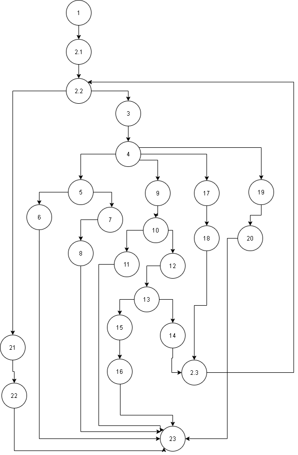

# Втора лабораториска вежба по Софтверско инженерство  
  
## Кристијан Темелковски, бр. на индекс 163234

**Control Flow Graph**

**Цикломатска комплексност на функцијата**
  
Цикломатската комплексност е пресметана со формулата Cyclomatic complexity = E-N+2 = R каде E е бројот на ребра,
 N е бројот на нодови и R e бројот на региони. Се бараат регионите за да се одреди цикломатската комплексност. 
Во овој CFG има 25 нодови, 31 ребро и според формулата се добива дека има:  
**8 региони**
  
**Multiple Condition** 
  
**if( hr < 0 || hr > 24 )**  
| combination | possible test case | branch |
|-------------|--------------------|--------|
| TX          | -1, 1, 11          |   4-5  |
| FT          | 25, 40, 40         | 4-5    |
| TT          | 12, 12, 12         | 4-9    |  

**if ( min < 0 || min > 59 )**  
| combination | possible test case | branch |
|-------------|--------------------|--------|
| TX          | 1, -1, 6           |  10-11 |
| FT          | 1, 61, 50          | 10-11  |
| FF          | 12, 12, 12         | 10-12  |  
  
**if ( sec >= 0 && sec <=59 )**  
| combination | possible test case | branch |
|-------------|--------------------|--------|
| FX          | 12, 40, -2         |  13-15 |
| TF          | 12, 40, 70         | 13-15  |
| TT          | 12, 40, 40         | 13-14  | 

**if( hr == 24 && min == 0 && sec == 0 )**  
| combination | possible test case | branch |
|-------------|--------------------|--------|
| TTT         | 24, 0, 0           |  17-18 |
| TTF         | 24, 0, 1           | 17-19  |
| TFF         | 24, 1, 1           | 17-19  |  
  
**Every Branch**  
| arcs  | 24, 0, 0 | 25, 10, 10 | -1, 1, 11  | 25, 40, 40 | 1, 61, 50 | 12, 40, 40 | 12, 40, -2 |
|-------|----------|------------|------------|------------|-----------|------------|------------|
| 4-5   |          |            |      *     |      *     |           |            |            |
| 5-6   |          |            |      *     |            |           |            |            |
| 5-7   |          |            |            |      *     |           |            |            |
| 4-7   |          |            |            |      *     |           |            |            |
| 4-9   |     *    |            |            |            |     *     |      *     |      *     |
| 4-17  |     *    |            |            |            |           |            |            |
| 19-20 |          |      *     |            |            |           |            |            |
| 4-19  |          |      *     |            |            |           |            |            |
| 9-10  |          |            |            |            |     *     |            |            |
| 9-17  |     *    |            |            |            |           |            |            |
| 9-12  |          |            |            |            |           |      *     |      *     |
| 10-11 |          |            |            |            |     *     |            |            |
| 10-12 |          |            |            |            |           |      *     |            |
| 13-14 |          |            |            |            |           |      *     |            |
| 13-15 |          |            |            |            |           |            |      *     |
| 17-18 |     *    |            |            |            |           |            |            |
| 17-19 |     *    |            |            |            |           |            |            |  
  
**Кратко објаснување**  
Со assertThrows се проверува дали се враќа ексепшн, а потоа се проверува дали ја вратил посакуваната порака. Ова се
прави за да не се измешаат исклучоците.  
Со assertTrue се проверува дали двата параметри се совпаѓаат.
